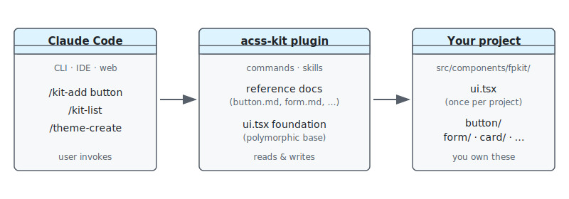
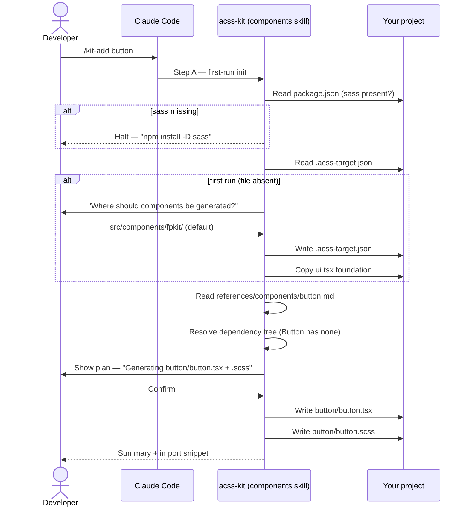
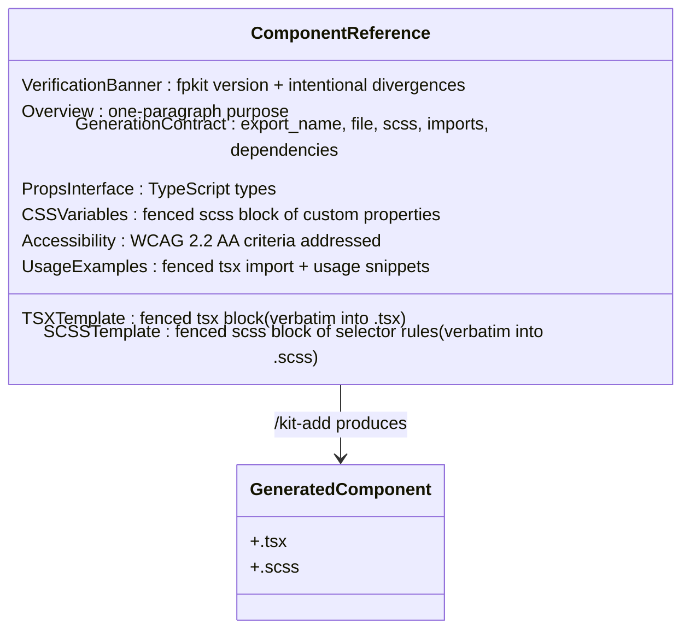
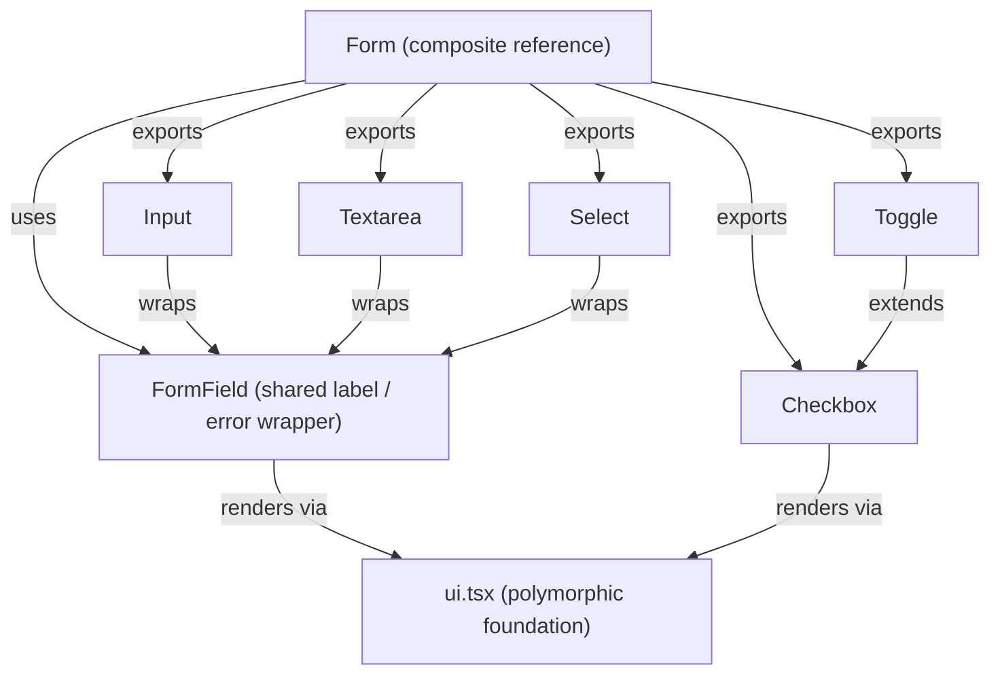
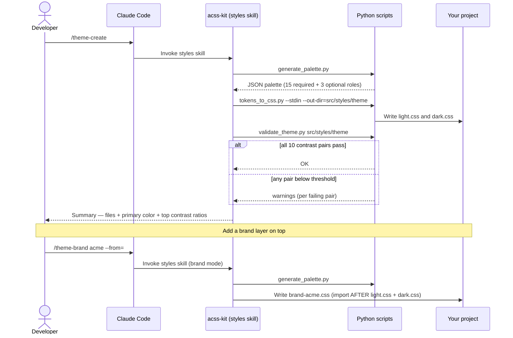
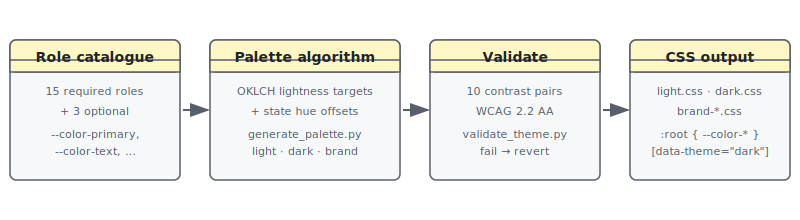
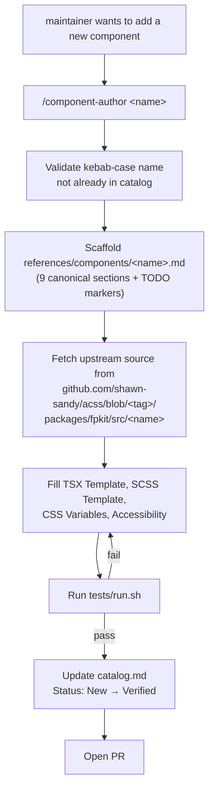

# acss-kit — Visual guide

> **Visual companion** to the prose docs. Diagrams orient; the canonical docs go deep. For a step-by-step linear walkthrough, read [tutorial.md](tutorial.md). For task-oriented snippets, read [recipes.md](recipes.md). For the mental model, read [concepts.md](concepts.md).

---

## 1. How to read this guide

Every section pairs a diagram (or two) with a short caption and a "Read the prose" link out to the canonical doc. Five visual formats appear below:

| Format | What it shows |
|---|---|
| Mermaid flowchart | A command's lifecycle — boxes are steps, arrows are transitions |
| Mermaid sequence diagram | An interaction over time — actors on top, time flowing down |
| Mermaid class diagram | The shape of a data structure — boxes are types, lines are relationships |
| ASCII tree | A directory layout — usually before / after a command |
| Hand-authored SVG or PNG | Architecture figures and terminal / browser screenshots |

Audience badges:

- **USER** — for developers who installed `acss-kit` and want to add components to their own app.
- **MAINTAINER** — for contributors editing the plugin itself.

> Diagrams version with the doc. If a slash command's interactive flow changes, the matching diagram changes in the same commit (see [CONTRIBUTING.md](../../../CONTRIBUTING.md)).

---

## 2. What is acss-kit?



The plugin lives outside your project. When you run `/kit-add <component>`, Claude Code loads the matching reference doc from inside the plugin, copies the polymorphic `ui.tsx` foundation into your project on first run, and writes a self-contained `.tsx` + `.scss` pair that you own outright. There is no `@fpkit/acss` runtime dependency in your bundle — the generated code is yours to edit.

> **Read the prose:** [concepts.md](concepts.md) for the full mental model and [README.md](README.md) for the index of every other doc.

---

## 3. Your first component (USER · simple)

The simplest example. Button has no component dependencies — only the shared `ui.tsx` foundation gets pulled in — so a single command produces a working component.

### The lifecycle



### The file output

Before:

```text
src/components/
└── (empty)
```

After:

```text
project-root/
├── .acss-target.json           # records the chosen target dir — commit this
└── src/components/fpkit/
    ├── ui.tsx                  # polymorphic foundation (one per project)
    └── button/
        ├── button.tsx          # Button + inlined useDisabledState hook
        └── button.scss         # styles with hardcoded fallbacks for every CSS var
```

### What you'd see in the terminal

```text
$ /kit-add button

Checking sass…              OK (sass-embedded found in devDependencies)
Reading .acss-target.json…  not found

Where should components be generated? (default: src/components/fpkit/)
> [Enter]

Wrote .acss-target.json
Created src/components/fpkit/ui.tsx (foundation — do not delete)

Generating the following files in src/components/fpkit/:
  New:
    button/button.tsx
    button/button.scss
  Skipped (already exist):
    (none)

Proceed? [Enter to continue, Ctrl+C to cancel]
> [Enter]

Wrote button/button.tsx
Wrote button/button.scss

Import and usage:
  import Button from './components/fpkit/button/button'
  import './components/fpkit/button/button.scss'

  <Button type="button" onClick={…}>Click me</Button>
```

<!-- Optional PNG screenshot: see plan step 6 to capture from a fresh tests/sandbox/.
     Save as assets/visual-guide/user-kit-add-button-terminal.png and uncomment the line below.
 -->

> **Read the prose:** [tutorial.md](tutorial.md) — the same walkthrough with copy-paste-ready code at each step.

---

## 4. The component anatomy

Every component the plugin can generate is described by a single markdown file in `skills/components/references/components/`. They all share the same nine-section shape, which keeps `/kit-add` parsing predictable and gives both audiences (users browsing, maintainers authoring) a consistent map.



The **Generation Contract** is the only machine-readable section — `/kit-add` parses `export_name`, `file`, `scss`, `imports`, and `dependencies` to figure out which files to write and which dependencies to resolve. The other eight sections are read by Claude (and you) to make correct code-generation decisions.

> **Read the prose:** [`button.md`](../skills/components/references/components/button.md) for the canonical example, or [architecture.md — How to add a new component reference](architecture.md#how-to-add-a-new-component-reference) for the maintainer view.

---

## 5. Composing components (USER · advanced)

Most apps need more than a single Button. When you ask `/kit-add` for a component that has dependencies, the plugin walks the dependency tree and writes everything needed in one pass. Files that already exist are skipped, so your customizations survive re-runs.

The Form bundle is the most useful example. Requesting `/kit-add form` writes the full set of form controls (`Input`, `Textarea`, `Select`, `Checkbox`, `Toggle`) plus the shared `FormField` wrapper that handles label association, error messages, and `aria-describedby`.

### The dependency tree



`/kit-add` resolves bottom-up: `ui.tsx` first (if not already present), then `Field`, then each leaf control, then the composite `Form` itself.

### The file output

After `/kit-add form` (first run, no prior `/kit-add` in this project):

```text
src/components/fpkit/
├── ui.tsx
└── form/
    ├── form.tsx            # Input, Textarea, Select, Checkbox, Toggle, FormField (named exports)
    └── form.scss           # shared form / input / checkbox / toggle styles
```

If you previously generated `Button` and now run `/kit-add form`, the existing `button/` directory is untouched.

> **Read the prose:** [recipes.md](recipes.md) for first-run init, multi-component runs, and regeneration — and the [`form.md` reference](../skills/components/references/components/form.md) for the full props matrix and accessibility notes.

---

## 6. Theming flow (USER · advanced)

Components ship with hardcoded CSS-variable fallbacks so they render the moment they land. Theming is purely additive: you generate a palette once and the components pick it up via `var(--color-primary, …)` references already in their SCSS.

### How a theme gets generated



### The token pipeline (under the hood)



Every theme file is just CSS custom properties — there is no JSON to maintain in your project. The schema is internal to the round-trip scripts; you author and edit `.css` directly.

> **Read the prose:** [styles SKILL.md](../skills/styles/SKILL.md) for all four flows (`/theme-create`, `/theme-brand`, `/theme-update`, `/theme-extract`) and [recipes.md](recipes.md) for common theming tasks.

---

## 7. Authoring a new component reference

<details>
<summary><strong>For plugin maintainers</strong> — click to expand</summary>

Adding a new component to the plugin means writing a new reference doc that follows the canonical nine-section shape. The `/component-author` maintainer skill scaffolds the structure; you fill in the per-component specifics from the upstream `shawn-sandy/acss` source.



The validation gate (`tests/run.sh`) extracts the TSX and SCSS from the fenced code blocks and syntax-checks them, validates the SCSS contract (rem units, fallback-bearing `var()` calls, `[aria-disabled="true"]` selectors), runs WCAG contrast on the bundled themes, and replicates the manifest checks. A passing run looks roughly like:

```text
$ tests/run.sh

[1/6] wipe tests/.tmp/                                OK
[2/6] extract & syntax-check TSX from refs (18)       OK
[3/6] SCSS contract validation                        OK
[4/6] WCAG contrast on bundled themes                 OK
[5/6] manifest / structure replication                OK
[6/6] known-bad self-tests                            OK

All checks passed (≈ 28s).
```

<!-- Optional PNG screenshot: see plan step 6 to capture and save as
     assets/visual-guide/maintainer-tests-run-passing.png, then uncomment:
 -->

> **Read the prose:** [architecture.md](architecture.md) for the contributor guide and [CONTRIBUTING.md](../../../CONTRIBUTING.md) for the sibling-clone workflow against `shawn-sandy/acss`.

</details>

---

## 8. Where to go next

| You want to… | Read |
|---|---|
| Generate your first component end-to-end | [tutorial.md](tutorial.md) |
| Solve a specific task (regenerate, change target dir, multiple components in one pass) | [recipes.md](recipes.md) |
| Understand the polymorphic UI base, data-* variants, and CSS-var fallbacks | [concepts.md](concepts.md) |
| Look up a slash command flag | [commands.md](commands.md) |
| Diagnose a failure | [troubleshooting.md](troubleshooting.md) |
| Author a new component or theme inside the plugin | [architecture.md](architecture.md) and [CONTRIBUTING.md](../../../CONTRIBUTING.md) |
| Browse the canonical reference docs | [`skills/components/references/components/`](../skills/components/references/components/) |

---

This guide is a portal — diagrams orient, prose explains. Found a diagram that no longer matches the command it describes? File an issue or open a PR; the maintenance rule lives in [CONTRIBUTING.md](../../../CONTRIBUTING.md).
